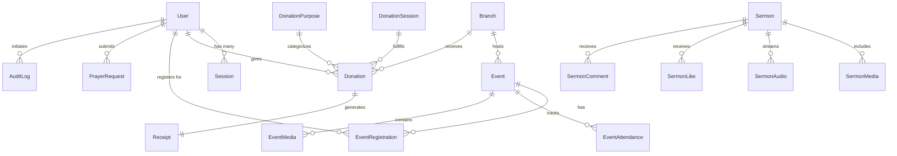

# KCM Entity Data Model & Relational Mapping

## 1. Core Domain Models

### User & Identity Domain
- **`User` (table `members`)**: Central identity entity storing profile, credentials hash, assigned `UserRole`, and relational linkages to all user-initiated interactions.
- **`Session` (table `sessions`)**: Stateful server-side session store with token hash, expiration timestamps, IP hash, and user-agent hash.
- **`MemberNotificationPreference`**: Granular notification opt-ins across SMS, Email, and Push channels.

### Event & Ministry Domain
- **`Event` (table `events`)**: Church gatherings, youth meetings, conferences with slug, start/end timestamps, seat limits, and venue mapping.
- **`EventRegistration` (table `event_registrations`)**: Compound unique constraint on `[userId, eventId]` preventing duplicate registrations.
- **`EventAttendance` (table `event_attendance`)**: Physical and virtual check-in logs with verified timestamps and check-in admin reference.
- **`Branch` (table `branches`)**: Multi-campus definitions (Shapur Nagar, Subhash Nagar, Bahadurpally).

### Financial & Giving Domain
- **`Donation` (table `donations`)**: Financial offerings with exact amount, currency, donor linkage, purpose, Razorpay order/payment identifiers, and immutable verification flags.
- **`DonationSession` (table `donation_sessions`)**: Payment lifecycle tracking from `CREATED` through `VERIFIED` with expiry deadlines and QR generation rate counts.
- **`Receipt` (table `receipts`)**: Unique 80G tax receipts with cryptographic `verificationCode` and immutable PDF links.
- **`PaymentWebhook` (table `payment_webhooks`)**: Webhook payload audit log with unique `webhookEventId` derived from `SHA-256(orderId|paymentId)`.

### Media & Engagement Domain
- **`Sermon` (table `sermons`)**: Preached sermons with media URLs, sermon notes, transcripts, and interaction tables (`SermonLike`, `SermonBookmark`, `SermonComment`, `SermonView`).
- **`PrayerRequest`**: Member and visitor prayer submissions with privacy status and moderation workflow.
- **`IssueReport` (table `issue_reports`)**: User and member reported defects with sanitized technical context, severity, and resolution lifecycle.

## 2. Relational Entity Relationship Diagram

