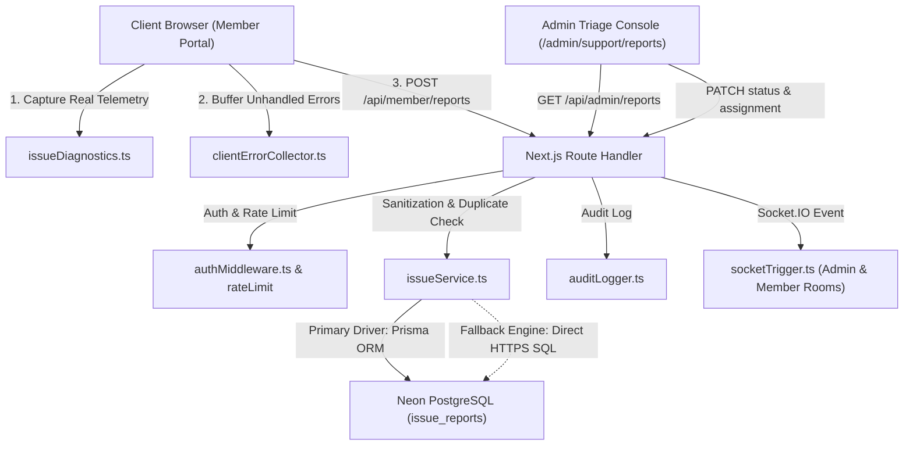

# Issue Reporting & Diagnostics Architecture

## System Architecture

## Architectural Principles

1. **Zero Simulated/Mock Data**:
   - Every metric, telemetry field, and diagnostic attribute is derived directly from browser APIs (`window.innerWidth`, `navigator.userAgent`, `navigator.onLine`, `Intl.DateTimeFormat`) or backend systems.
   - If an attribute is unsupported by the client platform, it resolves explicitly to `null` or `"unknown"`.

2. **Dual-Driver Persistence Layer**:
   - Primary: `@prisma/client` connecting through connection pooling.
   - Fallback: Direct HTTPS REST SQL endpoint against Neon host `ep-divine-credit-a589ua8g.us-east-2.aws.neon.tech/sql`. This ensures zero downtime if TCP port 5432 is restricted in edge environments.

3. **Event-Driven Real-Time Triage**:
   - Report creation broadcasts to the `admin` room.
   - Status updates broadcast to both the assigned member (`member:${userId}`) and the `admin` room.
   - Frontend components maintain resilient polling fallbacks in case WebSocket connections are interrupted.

4. **Data Model**:
   - `id`: UUID Primary Key.
   - `reportId`: Unique public reference `KCM-ERR-XXXXXXXX` (Base32 alphanumeric).
   - `userId`: Foreign key to `User`.
   - `category`: Enum representing functional domain.
   - `severity`: Enum (`LOW`, `MEDIUM`, `HIGH`, `CRITICAL`).
   - `status`: Lifecycle enum (`OPEN`, `INVESTIGATING`, `IN_PROGRESS`, `RESOLVED`, `CLOSED`, `DUPLICATE`).
   - `pageUrl`, `pagePath`, `pageTitle`, `referrer`.
   - Client specs: `browser`, `browserVersion`, `operatingSystem`, `deviceType`, `viewportWidth`, `viewportHeight`, `screenWidth`, `screenHeight`, `timezone`, `language`, `onlineStatus`, `connectionType`.
   - Diagnostics: `errorType`, `errorMessageSanitized`, `errorStackSanitized`, `correlationId`, `screenshotUrl`, `internalNotes`, `assignedTo`.
