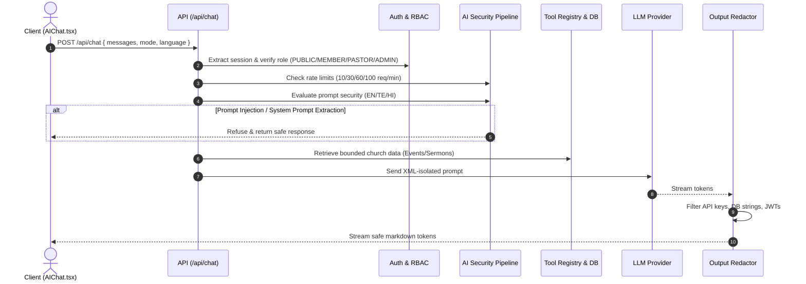

# KCM Assistant Security Guide

This document specifies the operational and technical security architecture for the **KCM Assistant** in Kingdom of Christ Ministries.

---

## 1. Core Security Tenets

1. **Zero-Trust LLM**: The AI model is considered an untrusted, external reasoning engine. It has **no direct database credentials**, cannot execute raw SQL or MongoDB queries, and cannot grant permissions.
2. **Server-Side Authority**: All authentication, role authorization, tool execution, and data filtering are enforced strictly in the Next.js API layer.
3. **Defense-in-Depth**: Multiple independent security controls (Input Normalization $\rightarrow$ Injection Filter $\rightarrow$ Context Isolation $\rightarrow$ Output Redaction $\rightarrow$ Link Sanitization).

---

## 2. Security Pipeline Flow

---

## 3. Environment Variables & Secret Handling

| Variable | Scope | Description |
| :--- | :--- | :--- |
| `OPENROUTER_API_KEY` | Server-only | Primary LLM gateway API key. |
| `OPENROUTER_API_KEY_2` | Server-only | Failover LLM gateway API key. |
| `OPENROUTER_API_KEY_3` | Server-only | Secondary failover API key. |
| `DATABASE_URL` | Server-only | PostgreSQL connection string for Prisma. |
| `MONGODB_URI` | Server-only | MongoDB Atlas connection string. |
| `SESSION_SECRET` | Server-only | HMAC secret for session verification. |

> [!CAUTION]
> Never prefix backend AI API keys or database URLs with `NEXT_PUBLIC_`.
