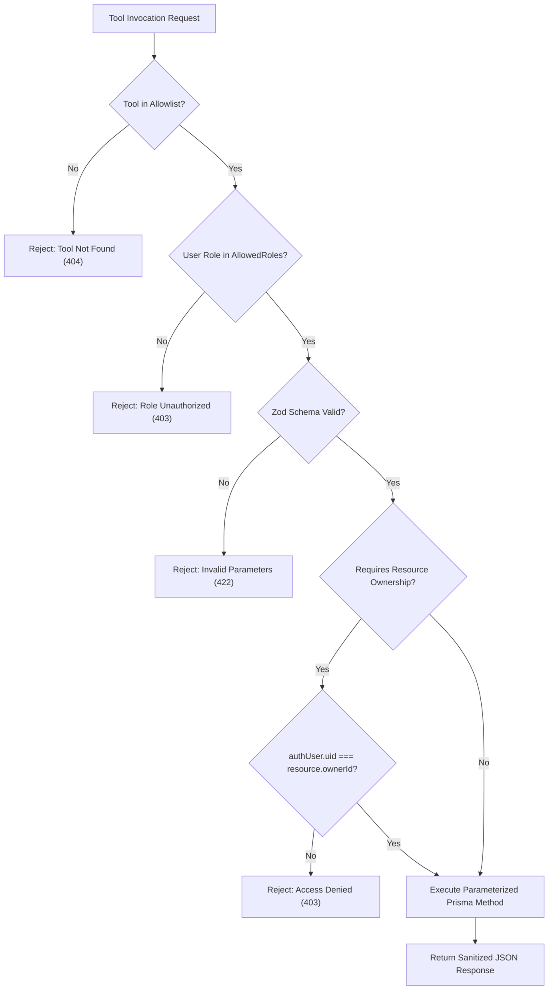

# Server-Side Tool Authorization & Allowlist

This document details the tool execution registry and security constraints governing tool invocations by the **KCM Assistant**.

---

## 1. Zero Dynamic Execution Policy

- **No Arbitrary SQL / MongoDB Execution**: The LLM cannot formulate raw queries or command strings for database execution.
- **Explicit Allowlist**: Tools can only be called if they exist in `AI_TOOL_REGISTRY` in `frontend/lib/ai/aiToolsRegistry.ts`.
- **Default Deny**: Any unmapped or unrecognized tool invocation is denied with a 403 Forbidden status.

---

## 2. Tool Execution Workflow

---

## 3. Tool Inventory

### Public Tools
1. `get_public_church_info`: Official church contact, registration, and UPI ID.
2. `get_public_service_times`: Weekly prayer, fasting, and worship schedules.
3. `get_public_events`: Published church events from PostgreSQL.
4. `get_public_sermons`: Preached messages from PostgreSQL.

### Member Tools
1. `get_my_profile`: Authenticated user's profile details.
2. `get_my_prayers`: Personal submitted prayer requests.
3. `create_my_prayer_request`: Validates description and creates a prayer request record.

### Pastor Tools
1. `get_authorized_prayer_stats`: Total counts of pending, active, and answered prayer requests.
