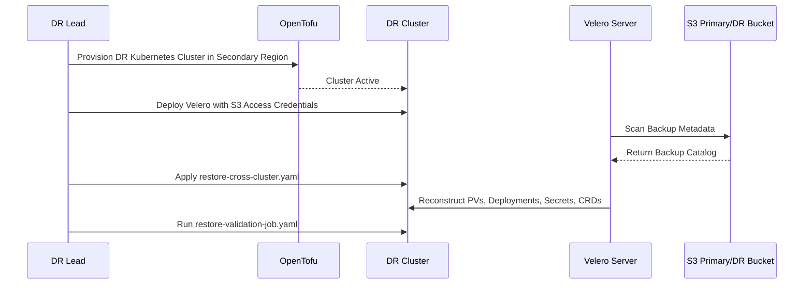

# Disaster Recovery Plan & Business Continuity

## Metrics & Targets
- **Recovery Time Objective (RTO)**: Target < 4 Hours for complete cluster restoration.
- **Recovery Point Objective (RPO)**: Target < 1 Hour for transactional databases and critical application state.

## Failover Workflow

