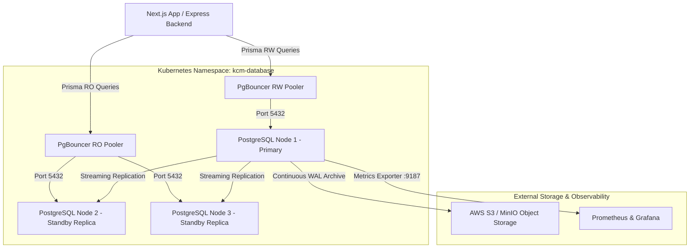

# Kingdom of Christ Ministries - Database Architecture Specification

## Architecture Overview
The KCM Enterprise Database Platform is built on top of official **CloudNativePG v1.23** deployed in Kubernetes. It provides a production-ready, highly available, secure, and self-healing PostgreSQL cluster tailored for Node.js/Express and Next.js applications using Prisma ORM.

### Architecture Diagram (Mermaid)

## Key Components
1. **CloudNativePG Operator**: Manages cluster lifecycle, failover, rolling updates, and backups.
2. **3-Node PostgreSQL HA Cluster**: 1 Primary + 2 Standby Replicas spread across nodes.
3. **PgBouncer Connection Poolers**: Dedicated Transaction-mode poolers for Read-Write and Read-Only traffic.
4. **Barman Object Store**: Streaming WAL archiving and physical base backups for PITR up to 30 days.
5. **Observability**: Prometheus `PodMonitor`, Grafana dashboard, and Alertmanager rules.
